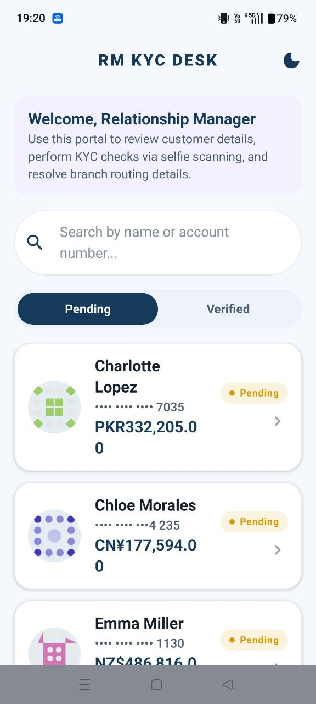
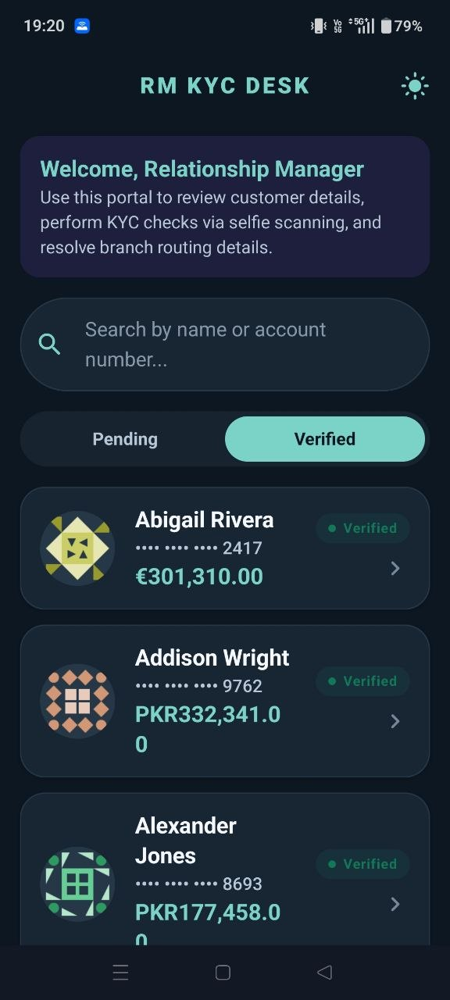
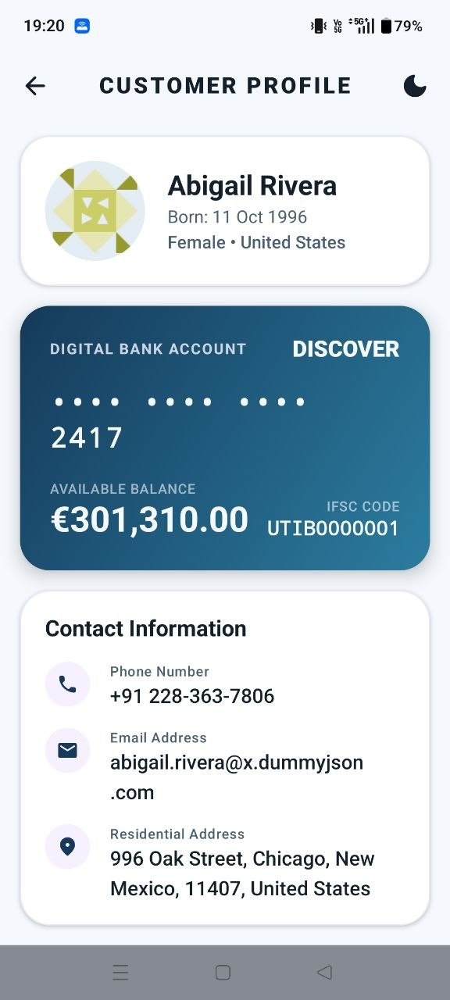
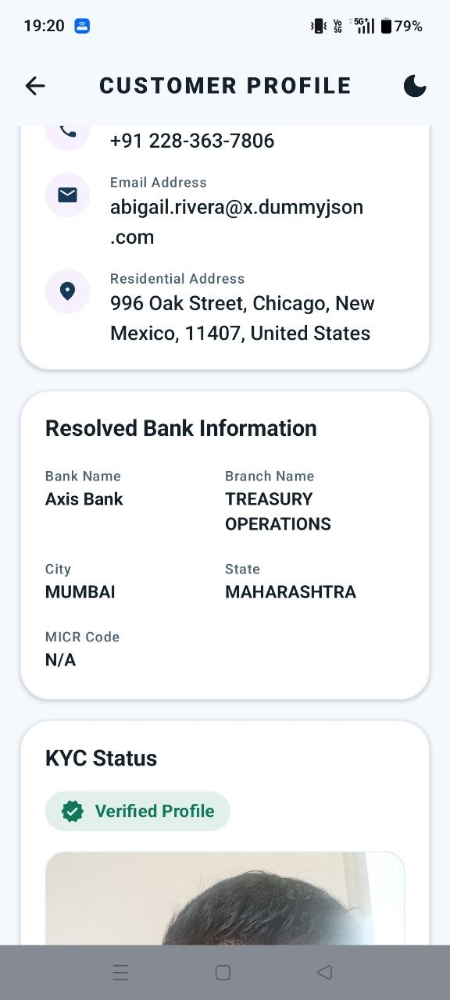
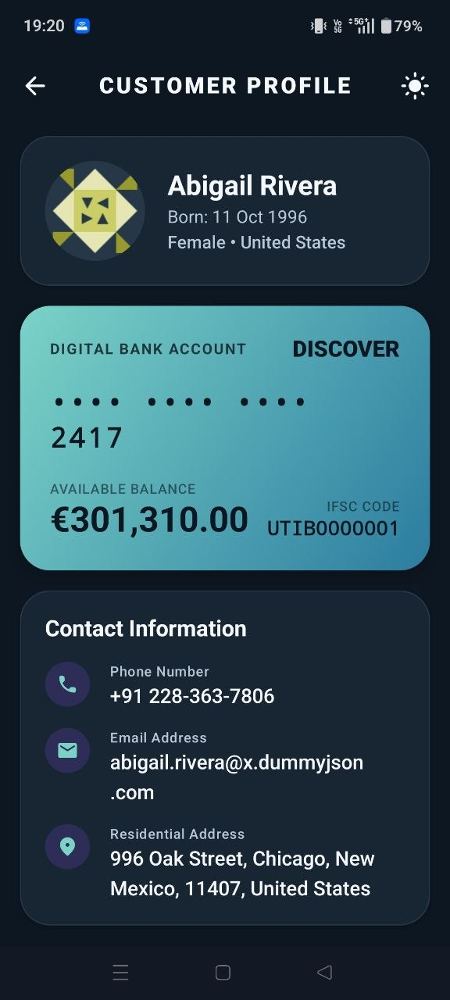
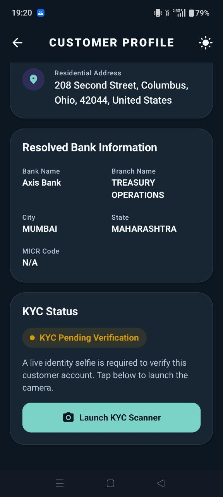

# 🏦 Android KYC Banking Application

A modern Android Banking KYC application built using **Kotlin**, **Jetpack Compose**, **MVVM**, **Clean Architecture**, **Hilt**, **Retrofit**, **Room**, and **CameraX**.

This application simulates a digital banking platform where Relationship Managers can browse customer accounts, verify customer KYC through an in-app selfie capture, and resolve bank branch information using IFSC codes.

---

# 📱 Features

- 🔍 Search customers by name or account number
- 📑 Pending & Verified KYC tabs
- 👤 Customer profile and account details
- 🏦 Live IFSC bank and branch resolution
- 📷 In-app CameraX selfie capture
- ✅ Complete KYC verification flow
- 💾 Local persistence using Room Database
- 🌐 API integration with DummyJSON & Razorpay IFSC
- 📡 Offline caching
- 🌙 Material 3 UI with modern design
- ⚡ Kotlin Coroutines & StateFlow

---

# 📸 Screens

### Accounts Screen

- Customer Grid/List
- Search Bar
- Pending Tab
- Verified Tab
- Customer Cards

### Customer Details Screen

- Profile Information
- Account Information
- Bank Details
- IFSC Resolution
- KYC Verification
- Captured Selfie

---

# 🏗️ Architecture

The application follows **MVVM + Clean Architecture**.

```
Presentation
│
├── UI
├── Components
├── Navigation
├── ViewModels
│
Domain
│
├── Models
├── Repository Interfaces
│
Data
│
├── Remote
├── Local
├── Repository
├── Mapper
│
Dependency Injection
│
Utilities
```

---

# 🛠 Tech Stack

| Technology | Usage |
|------------|-------|
| Kotlin | Programming Language |
| Jetpack Compose | UI Toolkit |
| Material 3 | UI Design |
| MVVM | Architecture |
| Hilt | Dependency Injection |
| Retrofit | REST API |
| Room | Local Database |
| CameraX | In-app Camera |
| Navigation Compose | Navigation |
| Coil | Image Loading |
| Coroutines | Asynchronous Programming |
| StateFlow | State Management |

---

# 🌐 APIs Used

### DummyJSON API

Provides

- Customer Information
- Profile
- Address
- Bank Details
- Avatar

https://dummyjson.com/users

---

### Razorpay IFSC API

Provides

- Bank Name
- Branch
- City
- State
- MICR

Example

https://ifsc.razorpay.com/HDFC0CAGSBK

---

# 📂 Project Structure

```
app
│
├── data
│   ├── local
│   ├── remote
│   ├── repository
│
├── domain
│   ├── model
│   ├── repository
│
├── presentation
│   ├── screens
│   ├── components
│   ├── navigation
│   ├── viewmodel
│
├── di
│
├── utils
```

---

# 🚀 Getting Started

### Clone Repository

```bash
git clone https://github.com/Skadekar2703/android-kyc-assignment.git
```

### Open Project

Open the project using **Android Studio**.

### Build

Sync Gradle and Run the application.

---

# 📋 Assignment Requirements Implemented

- ✅ Kotlin
- ✅ Jetpack Compose
- ✅ MVVM Architecture
- ✅ Clean Architecture
- ✅ Dependency Injection (Hilt)
- ✅ Retrofit Networking
- ✅ Room Database
- ✅ CameraX Selfie Capture
- ✅ Runtime Camera Permission
- ✅ Search Functionality
- ✅ Pending & Verified Tabs
- ✅ IFSC Resolution
- ✅ Local Data Persistence
- ✅ Offline Cache
- ✅ Loading / Error / Empty States

---

# 📸 Screenshots

## 🏠 Dashboard

| Light Theme | Dark Theme |
|-------------|------------|
|  |  |

---

## 👤 Customer Details

| Light Theme (Top) | Light Theme (Bottom) |
|-------------------|----------------------|
|  |  |

| Dark Theme (Top) | Dark Theme (Bottom) |
|------------------|---------------------|
|  |  |

| KYC Verified | KYC Pending |
|--------------|-------------|
|  |  |

---

# 🎥 Demo

> Screen recording will be added after implementation.

---

# 👨‍💻 Developer

**Soham Kadekar**

GitHub

https://github.com/Skadekar2703

---

# 📄 License

This project was developed as part of the **Signzy Android Developer Internship Assignment**.
